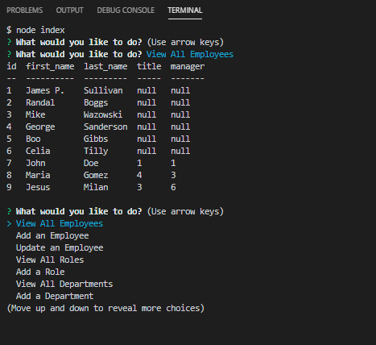

# Employee-Tracker

## What was the purpose of this application?
This node application allows us to keep track of the staff of a given company. We can track employees, roles and departments. You can view this categories in a table or add new ones.

## Techs used to complete this app
* JAVASCRIPT
* NODE
* EXPRESS
* MYSQL
* NPM
* INQUIRER
* CONSOLE.TABLE
  
## Who worked on this proyect?
for the moment I am the sole contributor, however if you want to contribute you, I can be contacted at the links provided below.

## How can we test this app?
This application runs on a terminal of your chosing running node.js

## Images of code

## Questions?
[GitHub:] https://github.com/Milan1422
[Email:] jmilan.gonzalez@gmail.com